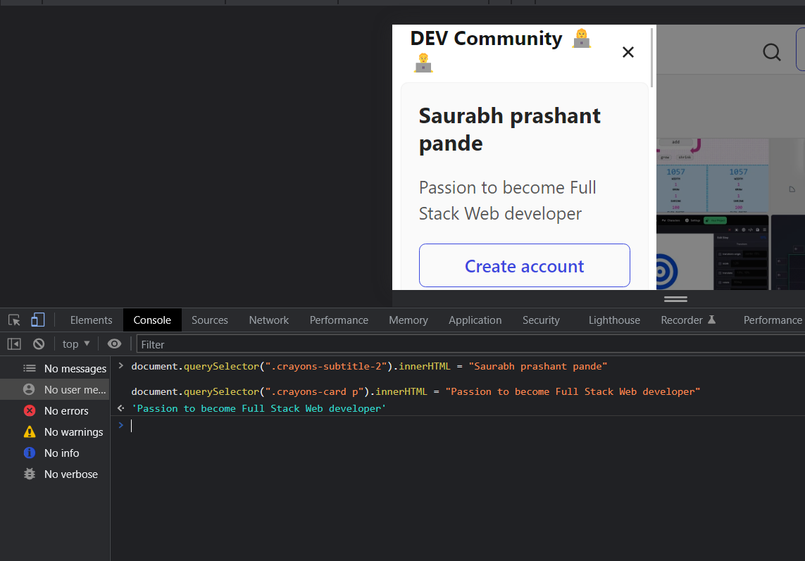
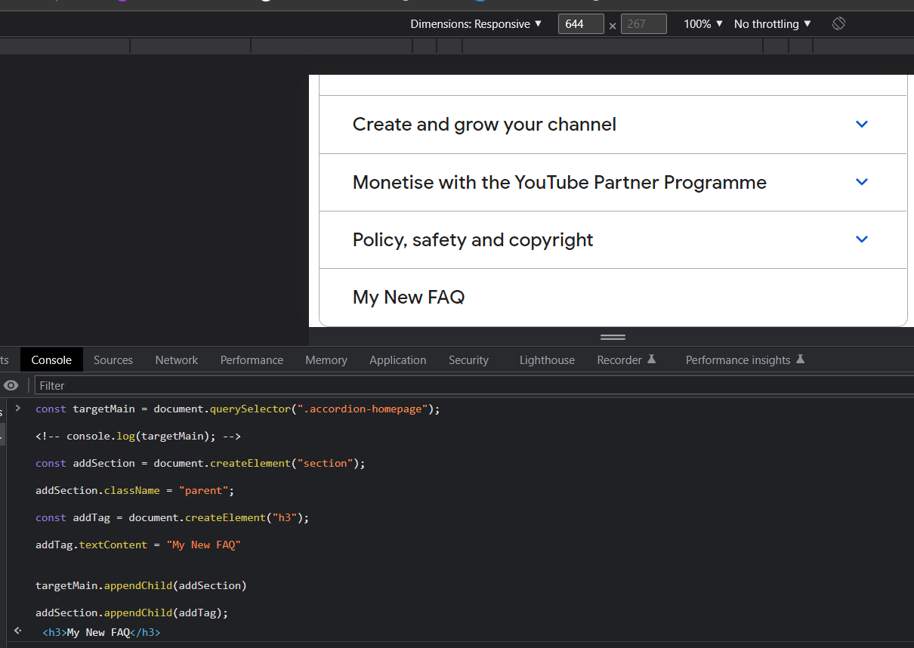
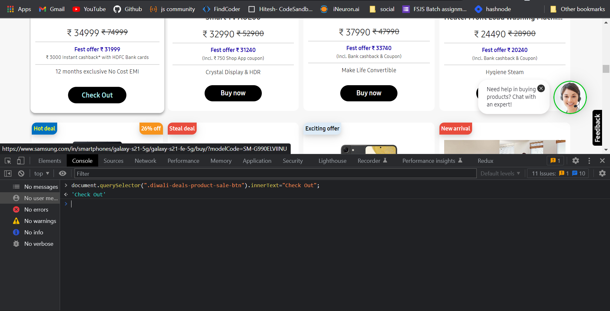
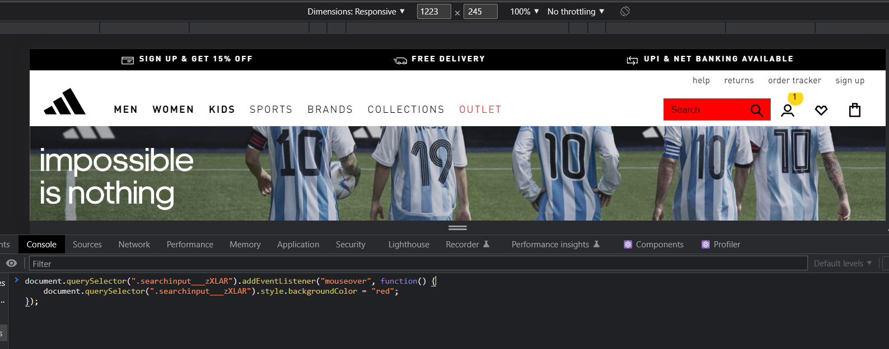

<!-- @format -->

# Dom Manipulation Assignment

1. Webiste Name: [Dev To](https://dev.to/)

### Topics

    - Query Selctory, Inner HTML

### Sample Image


### Tasks

        Target the Top description div and change the DEV Community to <Your_Name> and description to your passion

### Code

    document.querySelector(".crayons-subtitle-2").innerHTML = "Saurabh prashant pande"

    document.querySelector(".crayons-card p").innerHTML = "Passion to become Full Stack Web developer"

### Output



2. Website Name: [Apple](https://support.apple.com/en-in)

### Task


### Fetch all the product name and store in an array

###

### Output


['iPhone', 'Mac', 'iPad', 'Watch', 'AirPods', 'Music', 'TV']

3. Webiste Name: [Youtube Support](https://support.google.com/youtube/)

### Topics

    - Get Element By Id, Create Element, Create Text Node, Append Child

### Sample Image


### Tasks

     Add another FAQ 'My New FAQ' to the list

### Code

```

const targetMain = document.querySelector(".accordion-homepage");

const addSection = document.createElement("section");

addSection.className = "parent";

const addTag = document.createElement("h3");

addTag.textContent = "My New FAQ"

targetMain.appendChild(addSection)

addSection.appendChild(addTag);

```

### Output



4. Webiste Name: [OnePlus](https://www.oneplus.in/support)

### Topics

     Query Selector, InnerText

### Sample Image


### Tasks

      Change the contact number

### Code

     document.querySelector(".customer-support a").innerText = '+09665083954'

### Output


5. Webiste Name: [Samsung](https://www.samsung.com/in/offer/online/samsung-fest/)

### Topics

       getElementById, createElement, InnerText, append, setAttribute

### Sample Image


### Tasks

     Target the main div of card and change the Button text to Check out

### Code

```
document.querySelector(".diwali-deals-product-sale-btn").innerText="Check Out";
```

### Output



6. Webiste Name: [Adidas](https://www.adidas.co.in/)

### Topics

    -   Query Selector, Event listeners, Changing Styles

### Sample Image


### Tasks

     Target the search box and on hover change thebackground color to red.

### Code

```

      const find = document.querySelector(".searchinput___19uW0")
      find.addEventListener("mouseover", changbg)
      function changbg(){
      find.style.backgroundColor = "red"
      };
    
      /*or*/ 

      document.querySelector(".searchinput___zXLAR").addEventListener("mouseover", function() {
      document.querySelector(".searchinput___zXLAR").style.   backgroundColor = "red";
});

```

### Output



7. Webiste Name: [MDN Web Docs](https://developer.mozilla.org/en-US/)

### Topics

       Form, Value, Submit

### Sample Image


### Tasks

     To Search a topic in the MDN Search bar.
     First add a text to search in the search bar and then hit the submit search button to search the docs using DOM

### Output


8. Webiste Name: [Google](https://www.google.com/)

### Topics

       Remove Elements

### Sample Image


### Tasks

     Remove alternate languages from the home page languages listed

### Code

    let x = document.querySelectorAll('.z4hgWe a')
    x.forEach((a,index)=>{
    index % 2 == 0 && a.remove()
    })

### Output


9. Webiste Name: [Github](https://github.com/new)

### Topics

       Change Font Family, Color of Text.

### Sample Image


### Tasks

     change the background colour of the button to blue.

### Code

    document.querySelector(".Subhead mb-3 , h1").style.backgroundColor = "blue"

    document.querySelector(".Subhead mb-3 , h1").style.fontFamily = "roman"

'roman'

### Output


13. Webiste Name: [Hackerrank](https://www.hackerrank.com/)

### Topics

       querySelector,innerHtml

### Sample Image


### Tasks

Target the top description and change “Matching developers with great companies” to ‘JSBOOTCAMP“.

### Code

     document.querySelector("h1 span").innerHTML = "JSBOOTCAMP"

### Output


14. Webiste Name: [Asus](https://www.asus.com/in/)

### Topics

      querySelector,style,font-size

### Sample Image


### Tasks

       change the fontsize of “Hot Deals” to 80px

### Code

     document.querySelector(".HotDealsAll__Heading__2fIbe").style.fontSize = "80px"

### Output


15. Webiste Name: [Dell](https://www.dell.com/en-in/shop/deals/laptop-deals?gacd=10415953-9016-5761040-285981356-0&dgc=ST&gclid=Cj0KCQjwguGYBhDRARIsAHgRm4-XUDMhhVNyHXb3s1gY4ZBzORr_d9Se-buhJwy7asyUe7YdqEA11eEaAt6UEALw_wcB&gclsrc=aw.ds&nclid=BxjBlpBQsX6pjSHh-L8YYSU77EpfXRkG1AGMB5Wbeu386ykspfrPDnfx_DdFau20)

### Topics

      querySelector,style.textAlign

### Sample Image


### Tasks

       Convert the text “G15 Gaming Laptop” from left to right

### code

     document.querySelector("h1 span").style.textAlign = "right";

### Output


16. Webiste Name: [Vercel](https://vercel.com/)

### Topics

     querySelector,innerHTMl

### Sample Image


### Tasks

      change the heading “Start with the developer” to “Start with Scratch”

### Code

    document.querySelector("section-label_label__IXpQ5 ,h4").innerHTML = "Start with Scratch"

### Output


17. Webiste Name: [Sony](https://www.sony.co.in/)

### Topics

    querySelector,innerHTMl

### Sample Image


### Tasks

    change the background colour blue to orange

### Code

     document.querySelector('.p-footer').style.backgroundColor = "Orange"

### Output


19. Webiste Name: [Canon](https://in.canon/)

### Topics

          querySelector,src

### Sample Image


### Tasks

    extract the canon logo

### Code

     document.querySelector(".logo").src

### Output


20. Webiste Name: [Oppo](https://www.oppo.com/in/)

### Topics

          querySelector,style,color

### Sample Image


### Tasks

      Change the description colour black to orange

### Code

     document.querySelector(".section-box h3").style.color = "orange"

### Output


